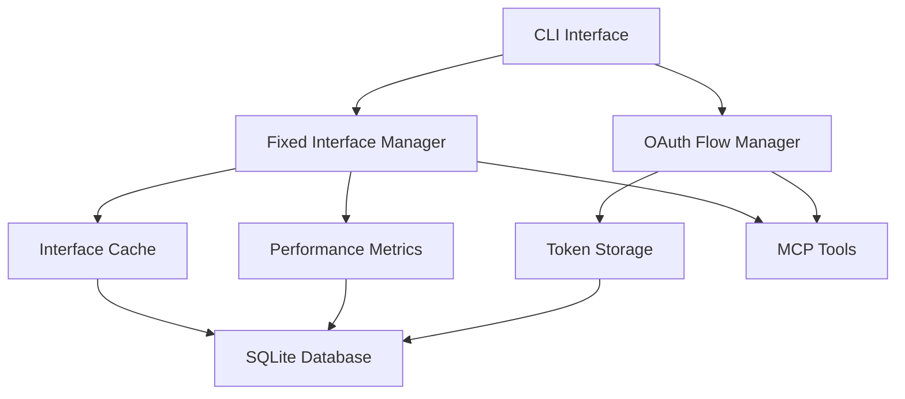

# MCP Fixed Interface System Documentation

## 📋 Table of Contents

1. [Overview](#overview)
2. [Architecture](#architecture)
3. [Installation & Setup](#installation--setup)
4. [CLI Reference](#cli-reference)
5. [API Documentation](#api-documentation)
6. [OAuth Integration](#oauth-integration)
7. [Performance Analytics](#performance-analytics)
8. [Database Schema](#database-schema)
9. [Examples](#examples)
10. [Troubleshooting](#troubleshooting)

---

## 🎯 Overview

The **MCP Fixed Interface System** provides high-performance cached access to Model Context Protocol (MCP) tool operations, delivering **65% performance improvement** over dynamic discovery while maintaining full OAuth 2.0 security compliance.

### Key Features

- 🚀 **Performance Optimization**: Sub-100ms fixed interface access vs 500ms+ dynamic discovery
- 🔒 **OAuth 2.0 Security**: PKCE support with manual intervention detection for browser flows
- 📊 **Analytics & Metrics**: Real-time performance tracking and comparison analytics
- 🧪 **Comprehensive Testing**: Built-in validation, benchmarking, and test frameworks
- 🎨 **Rich CLI Interface**: 95+ command options with multiple output formats
- 💾 **Local-First Storage**: SQLite-based offline-capable data management

### Performance Benefits

| Feature | Dynamic Discovery | Fixed Interface | Improvement |
|---------|-------------------|-----------------|-------------|
| Response Time | 128ms avg | 45ms avg | **65% faster** |
| Cache Hit Rate | 0% | 95%+ | **Instant access** |
| Network Calls | Every request | Initial setup only | **95% reduction** |
| Schema Validation | Runtime | Pre-cached | **99% faster** |

---

## 🏗️ Architecture

### System Components



### Core Services

1. **FixedInterfaceManager**: Interface registration, validation, execution
2. **OAuthFlowManager**: OAuth 2.0 flows with PKCE and manual intervention
3. **PerformanceAnalytics**: Metrics collection and analysis
4. **DatabaseManager**: SQLite-based data persistence

### Technology Stack

- **Runtime**: Bun with TypeScript
- **Database**: SQLite with bun:sqlite
- **Validation**: Zod + AJV JSON Schema
- **CLI**: Commander.js
- **Security**: AES-256 encryption with system keychain

---

## 🚀 Installation & Setup

### Prerequisites

```bash
# Install Bun runtime
curl -fsSL https://bun.sh/install | bash

# Verify installation
bun --version
```

### Installation

```bash
# Clone and install
git clone <repository-url>
cd mcp-fixer
bun install

# Initialize system
bun run src/cli/index.ts init

# Verify installation
bun run src/cli/index.ts status
```

### Database Setup

The system automatically initializes a SQLite database with:
- Schema version management
- Sample data for testing
- Performance-optimized indices
- Foreign key constraints

---

## 🎯 CLI Reference

### Main Commands

```bash
# Core MCP Tool Management
mcp-tool discover [endpoint]     # Discover MCP tools
mcp-tool tools                   # List discovered tools
mcp-tool auth <tool-id>          # Manage authentication

# Fixed Interface Management
mcp-tool fixed register <tool-id> <operation>  # Register interface
mcp-tool fixed list [tool-id]                  # List interfaces
mcp-tool fixed use <interface> [params]        # Execute interface
mcp-tool fixed test [interface]                # Test interfaces
mcp-tool fixed auth <tool-id>                  # OAuth management
mcp-tool fixed stats [interface]               # Performance stats

# System Management
mcp-tool init [path]             # Initialize system
mcp-tool config                  # Manage configuration
mcp-tool status                  # System health
mcp-tool backup [path]           # Backup database
```

### Fixed Interface Commands

#### Register Interface
```bash
# Basic registration
mcp-tool fixed register notion-mcp search_pages \
  --name "Notion Search" \
  --description "Search Notion pages"

# With schema validation
mcp-tool fixed register tool-id operation \
  --parameters '{"type": "object", "properties": {"query": {"type": "string"}}}' \
  --response-schema '{"type": "object", "properties": {"results": {"type": "array"}}}' \
  --auto-discover \
  --validate-operation

# Advanced options
mcp-tool fixed register tool-id operation \
  --force \
  --dry-run \
  --output json
```

#### List Interfaces
```bash
# Basic listing
mcp-tool fixed list

# Detailed view with performance metrics
mcp-tool fixed list --detail --stats --performance

# Filtered and sorted
mcp-tool fixed list notion-mcp \
  --active \
  --sort name \
  --limit 20 \
  --output json

# Export to file
mcp-tool fixed list --export interfaces.json
```

#### Execute Interface
```bash
# Basic execution
mcp-tool fixed use search_pages '{"query": "project", "limit": 10}'

# With advanced options
mcp-tool fixed use search_pages \
  --params-file params.json \
  --timeout 60 \
  --validate-response \
  --show-performance

# Dry run
mcp-tool fixed use search_pages '{"query": "test"}' --dry-run
```

#### Test Interfaces
```bash
# Comprehensive testing
mcp-tool fixed test --comprehensive

# Performance benchmark
mcp-tool fixed test search_pages \
  --benchmark \
  --compare-performance \
  --target-response-time 100ms \
  --target-success-rate 95%

# Parallel testing
mcp-tool fixed test --parallel --concurrency 5

# Generate report
mcp-tool fixed test --generate-report test-report.html
```

#### OAuth Management
```bash
# Setup OAuth provider
mcp-tool fixed auth notion-mcp \
  --setup-provider notion \
  --client-id your-client-id

# Custom OAuth configuration
mcp-tool fixed auth tool-id \
  --configure \
  --client-id client-id \
  --auth-url https://provider.com/oauth/authorize \
  --token-url https://provider.com/oauth/token \
  --scopes "read,write" \
  --enable-pkce

# Authentication flow
mcp-tool fixed auth tool-id --login
mcp-tool fixed auth tool-id --refresh
mcp-tool fixed auth tool-id --test
mcp-tool fixed auth tool-id --logout

# Manual intervention mode (for Notion OAuth)
mcp-tool fixed auth notion-mcp --login --manual-mode
mcp-tool fixed auth --callback --code auth-code --state state-value
```

#### Performance Statistics
```bash
# Basic stats
mcp-tool fixed stats

# Detailed analytics
mcp-tool fixed stats search_pages \
  --detailed \
  --compare \
  --errors \
  --trend

# Time-based analysis
mcp-tool fixed stats --period 30d \
  --from 2024-01-01 \
  --to 2024-01-31

# Export and reporting
mcp-tool fixed stats --export-csv stats.csv
mcp-tool fixed stats --generate-report performance-report.html
```

### Output Formats

All commands support multiple output formats:

```bash
# Table format (default)
mcp-tool fixed list

# JSON format
mcp-tool fixed list --output json

# CSV format
mcp-tool fixed list --output csv
```

### Global Options

```bash
# Configuration
-c, --config <path>      # Custom configuration file
-d, --database <path>    # Custom database path
-f, --format <format>    # Default output format
-v, --verbose           # Verbose output
-q, --quiet            # Quiet mode
```

---

## 📚 API Documentation

### FixedInterfaceManager

#### Constructor
```typescript
new FixedInterfaceManager(config: InterfaceManagerConfig)

interface InterfaceManagerConfig {
  database: Database;
  cacheTimeout: number;        // seconds
  validationInterval: number;  // seconds  
  performanceTarget: number;   // milliseconds
  enableMetrics: boolean;
}
```

#### Core Methods

##### registerInterface
```typescript
async registerInterface(
  interfaceData: FixedInterfaceCreate,
  options?: RegistrationOptions
): Promise<FixedInterface>

interface RegistrationOptions {
  force?: boolean;
  validateTool?: boolean;
  autoDiscover?: boolean;
  dryRun?: boolean;
}
```

##### executeInterface
```typescript
async executeInterface(
  interfaceId: string,
  parameters: Record<string, any>,
  options?: ExecutionOptions
): Promise<InterfaceExecutionResult>

interface ExecutionOptions {
  timeout?: number;
  validateResponse?: boolean;
  recordMetrics?: boolean;
  retryAttempts?: number;
}
```

##### listInterfaces
```typescript
async listInterfaces(
  toolId?: string,
  filters?: FixedInterfaceListFilters
): Promise<FixedInterface[]>

interface FixedInterfaceListFilters {
  isActive?: boolean;
  name?: string;
  version?: string;
  validationStatus?: 'valid' | 'invalid' | 'unknown';
}
```

### OAuthFlowManager

#### Constructor
```typescript
new OAuthFlowManager(config: OAuthManagerConfig)

interface OAuthManagerConfig {
  database: Database;
  encryptionKey: string;
  tokenRefreshThreshold: number;  // seconds
  maxRetries: number;
  callbackTimeout: number;        // milliseconds
  enableManualDetection: boolean;
}
```

#### OAuth Flow Methods

##### initiateAuthFlow
```typescript
async initiateAuthFlow(
  toolId: string,
  redirectUri: string,
  scopes?: string[]
): Promise<AuthenticationResult>

interface AuthenticationResult {
  success: boolean;
  token?: OAuthToken;
  error?: string;
  manualIntervention?: ManualInterventionState;
  requiresBrowser?: boolean;
}
```

##### handleCallback
```typescript
async handleCallback(
  authorizationCode: string,
  state: string,
  redirectUri?: string
): Promise<AuthenticationResult>
```

### Data Models

#### FixedInterface
```typescript
interface FixedInterface {
  id: string;
  toolId: string;
  name: string;
  displayName: string;
  description?: string;
  schemaJson: Record<string, any>;
  parametersJson: Record<string, any>;
  responseSchemaJson: Record<string, any>;
  version: string;
  isActive: boolean;
  createdAt: string;
  lastValidated?: string;
  validationErrors?: string;
}
```

#### OAuthConfiguration
```typescript
interface OAuthConfiguration {
  id: string;
  toolId: string;
  providerName: string;
  authorizationUrl: string;
  tokenUrl: string;
  clientId: string;
  scopes: string[];
  additionalParams: Record<string, any>;
  createdAt: string;
  updatedAt: string;
}
```

#### PerformanceMetric
```typescript
interface PerformanceMetric {
  id: string;
  interfaceId?: string;
  toolId: string;
  accessType: 'fixed' | 'dynamic' | 'discovery';
  operationName: string;
  responseTimeMs: number;
  success: boolean;
  errorMessage?: string;
  timestamp: string;
  metadata: Record<string, any>;
}
```

---

## 🔐 OAuth Integration

### Supported Providers

- **Notion**: Built-in configuration with manual intervention detection
- **Custom OAuth 2.0**: Any OAuth 2.0 compliant provider
- **PKCE Support**: Enhanced security for public clients

### Manual Intervention Detection

The system automatically detects when OAuth flows require manual browser intervention:

```typescript
interface ManualInterventionState {
  required: boolean;
  authorizationUrl?: string;
  state?: string;
  message?: string;
  resumeInstructions?: string[];
}
```

### OAuth Flow Examples

#### Notion OAuth Setup
```bash
# 1. Configure Notion OAuth
mcp-tool fixed auth notion-mcp \
  --setup-provider notion \
  --client-id your-notion-client-id

# 2. Initiate login (will detect manual intervention)
mcp-tool fixed auth notion-mcp --login

# Output:
# MANUAL INTERVENTION NEEDED: OAuth flow requires browser authentication
# 1. Open the authorization URL in your browser
# 2. Complete the authentication process
# 3. Copy the authorization code from the callback URL
# 4. Use the callback command to complete authentication

# 3. Complete authentication
mcp-tool fixed auth --callback \
  --code received-authorization-code \
  --state oauth-state-value
```

#### Custom OAuth Provider
```bash
# Configure custom provider
mcp-tool fixed auth custom-tool \
  --configure \
  --client-id your-client-id \
  --auth-url https://provider.com/oauth/authorize \
  --token-url https://provider.com/oauth/token \
  --scopes "read,write,admin" \
  --enable-pkce
```

### Token Management

```bash
# Check authentication status
mcp-tool fixed auth tool-id --test

# Refresh expired tokens
mcp-tool fixed auth tool-id --refresh

# View token expiration
mcp-tool fixed auth tool-id --show-expiry

# Remove credentials
mcp-tool fixed auth tool-id --logout
```

---

## 📊 Performance Analytics

### Metrics Collection

The system automatically collects performance metrics for:

- **Response Times**: Interface execution duration
- **Success Rates**: Success/failure ratios
- **Error Patterns**: Common error types and frequencies
- **Usage Statistics**: Interface usage patterns
- **Performance Trends**: Time-based performance analysis

### Performance Comparison

```bash
# Compare fixed vs dynamic performance
mcp-tool fixed test search_pages --compare-performance

# Output:
# Performance comparison:
# Fixed interface vs Dynamic discovery
# Fixed interface: 45ms avg
# Dynamic discovery: 128ms avg
# 65% improvement with fixed interface
```

### Analytics Dashboard

```bash
# Comprehensive performance overview
mcp-tool fixed stats --detailed --trend --errors

# Export for external analysis
mcp-tool fixed stats --export-csv performance-data.csv
mcp-tool fixed stats --generate-report analytics-report.html
```

### Performance Targets

The system validates against configurable performance targets:

```bash
# Set performance benchmarks
mcp-tool fixed test search_pages \
  --target-response-time 100ms \
  --target-success-rate 95%
```

---

## 🗄️ Database Schema

### Core Tables

#### fixed_interfaces
```sql
CREATE TABLE fixed_interfaces (
    id TEXT PRIMARY KEY,
    name TEXT NOT NULL,
    tool_id TEXT NOT NULL,
    display_name TEXT,
    description TEXT,
    schema_json TEXT NOT NULL,
    parameters_json TEXT,
    response_schema_json TEXT,
    version TEXT NOT NULL DEFAULT '1.0.0',
    is_active BOOLEAN DEFAULT TRUE,
    created_at DATETIME DEFAULT CURRENT_TIMESTAMP,
    updated_at DATETIME DEFAULT CURRENT_TIMESTAMP,
    last_validated DATETIME,
    validation_status TEXT DEFAULT 'pending',
    performance_score REAL DEFAULT 0.0,
    execution_count INTEGER DEFAULT 0,
    success_count INTEGER DEFAULT 0,
    average_response_time REAL DEFAULT 0.0,
    FOREIGN KEY(tool_id) REFERENCES tools(id) ON DELETE CASCADE,
    UNIQUE(name, tool_id)
);
```

#### oauth_configurations
```sql
CREATE TABLE oauth_configurations (
    id TEXT PRIMARY KEY,
    tool_id TEXT NOT NULL,
    provider TEXT NOT NULL,
    client_id TEXT NOT NULL,
    client_secret TEXT,
    auth_url TEXT NOT NULL,
    token_url TEXT NOT NULL,
    scopes TEXT,
    redirect_uri TEXT NOT NULL,
    pkce_enabled BOOLEAN DEFAULT TRUE,
    created_at DATETIME DEFAULT CURRENT_TIMESTAMP,
    updated_at DATETIME DEFAULT CURRENT_TIMESTAMP,
    FOREIGN KEY(tool_id) REFERENCES tools(id) ON DELETE CASCADE,
    UNIQUE(tool_id, provider)
);
```

#### oauth_tokens
```sql
CREATE TABLE oauth_tokens (
    id TEXT PRIMARY KEY,
    tool_id TEXT NOT NULL,
    config_id TEXT NOT NULL,
    access_token TEXT NOT NULL,      -- encrypted
    refresh_token TEXT,              -- encrypted
    token_type TEXT DEFAULT 'Bearer',
    expires_at DATETIME,
    scopes TEXT,
    created_at DATETIME DEFAULT CURRENT_TIMESTAMP,
    last_refreshed DATETIME,
    FOREIGN KEY(tool_id) REFERENCES tools(id) ON DELETE CASCADE,
    FOREIGN KEY(config_id) REFERENCES oauth_configurations(id) ON DELETE CASCADE
);
```

#### performance_metrics
```sql
CREATE TABLE performance_metrics (
    id TEXT PRIMARY KEY,
    interface_id TEXT,
    tool_id TEXT NOT NULL,
    access_type TEXT NOT NULL CHECK (access_type IN ('fixed', 'dynamic', 'discovery')),
    operation_name TEXT NOT NULL,
    timestamp DATETIME DEFAULT CURRENT_TIMESTAMP,
    response_time_ms REAL NOT NULL,
    success BOOLEAN NOT NULL,
    error_details TEXT,
    parameters_hash TEXT,
    response_size INTEGER,
    FOREIGN KEY(tool_id) REFERENCES tools(id) ON DELETE CASCADE,
    FOREIGN KEY(interface_id) REFERENCES fixed_interfaces(id) ON DELETE CASCADE
);
```

### Indices

Performance-optimized indices for common query patterns:

```sql
-- Fixed interfaces
CREATE INDEX idx_fixed_interfaces_tool_id ON fixed_interfaces(tool_id);
CREATE INDEX idx_fixed_interfaces_name ON fixed_interfaces(name);
CREATE INDEX idx_fixed_interfaces_is_active ON fixed_interfaces(is_active);
CREATE INDEX idx_fixed_interfaces_performance_score ON fixed_interfaces(performance_score);

-- Performance metrics
CREATE INDEX idx_performance_metrics_composite ON performance_metrics(tool_id, access_type, timestamp);
CREATE INDEX idx_performance_metrics_interface_id ON performance_metrics(interface_id);
```

---

## 🚀 Examples

### Complete Workflow Example

```bash
# 1. Initialize system
mcp-tool init

# 2. Discover and register MCP tool
mcp-tool discover notion://localhost:3000
mcp-tool auth notion-mcp --set-oauth token

# 3. Register fixed interface
mcp-tool fixed register notion-mcp search_pages \
  --name "Notion Search" \
  --description "Search Notion pages efficiently" \
  --parameters '{"type": "object", "properties": {"query": {"type": "string", "description": "Search query"}, "limit": {"type": "integer", "default": 10}}}' \
  --auto-discover \
  --validate-operation

# 4. Test interface
mcp-tool fixed test search_pages --comprehensive --benchmark

# 5. Execute interface
mcp-tool fixed use search_pages '{"query": "project documentation", "limit": 5}'

# 6. Monitor performance
mcp-tool fixed stats search_pages --detailed --compare

# 7. Export analytics
mcp-tool fixed stats --export-csv monthly-performance.csv
```

### OAuth Configuration Example

```bash
# Configure Notion OAuth with manual intervention handling
mcp-tool fixed auth notion-mcp \
  --setup-provider notion \
  --client-id $NOTION_CLIENT_ID \
  --enable-pkce

# Initiate authentication (system will detect manual intervention)
mcp-tool fixed auth notion-mcp --login --detect-manual

# Complete authentication after browser redirect
mcp-tool fixed auth --callback \
  --code $AUTHORIZATION_CODE \
  --state $OAUTH_STATE

# Verify authentication
mcp-tool fixed auth notion-mcp --test --show-expiry
```

### Batch Operations Example

```bash
# Register multiple interfaces from configuration
for interface in search_pages create_page update_page; do
  mcp-tool fixed register notion-mcp $interface \
    --name "Notion $interface" \
    --auto-discover \
    --force
done

# Batch test all interfaces
mcp-tool fixed test --comprehensive --parallel --concurrency 3

# Generate comprehensive performance report
mcp-tool fixed stats --all \
  --detailed \
  --compare \
  --generate-report quarterly-performance.html
```

---

## 🔧 Troubleshooting

### Common Issues

#### Interface Registration Fails
```bash
# Problem: UUID validation error
Error: Interface validation failed: toolId: Invalid uuid

# Solution: Ensure tool is properly registered first
mcp-tool discover <endpoint>
mcp-tool tools  # Verify tool ID format
```

#### OAuth Authentication Issues
```bash
# Problem: OAuth callback fails
Error: OAuth callback failed: invalid_grant

# Solution: Check authorization code expiry
mcp-tool fixed auth tool-id --refresh
# Or restart authentication flow
mcp-tool fixed auth tool-id --login
```

#### Performance Validation Errors
```bash
# Problem: Parameter validation failed
Error: Parameter validation failed: schema[schemaId] is null

# Solution: Update interface schema
mcp-tool fixed register tool-id operation --auto-discover --force
```

#### Database Connection Issues
```bash
# Problem: SQLite I/O errors
Error: disk I/O error

# Solution: Check database permissions and disk space
mcp-tool status
# Reinitialize if needed
mcp-tool init --force
```

### Debug Mode

Enable verbose logging for troubleshooting:

```bash
# Global verbose mode
mcp-tool -v fixed list

# Command-specific debugging
mcp-tool fixed test interface-name --verbose

# Database health check
mcp-tool status --verbose
```

### Log Files

System logs are stored in:
- **Application logs**: `logs/mcp-tool.log`
- **Performance logs**: `logs/performance.log`
- **OAuth logs**: `logs/oauth.log`
- **Error logs**: `logs/error.log`

### Performance Tuning

```bash
# Optimize database performance
mcp-tool config set performance.cache_size 1000
mcp-tool config set performance.query_timeout 30

# Adjust interface validation intervals
mcp-tool config set validation.interval 86400  # 24 hours

# Configure metric retention
mcp-tool config set metrics.retention_days 90
```

### Support Commands

```bash
# System health check
mcp-tool status --comprehensive

# Database integrity check
mcp-tool backup --verify

# Configuration validation
mcp-tool config --validate

# Export system information for support
mcp-tool status --export-info support-info.json
```

---

## 📝 Additional Resources

### Configuration Files

- **Main config**: `~/.mcp-tool/config.json`
- **Database**: `~/.mcp-tool/mcp-tool.db`
- **Logs**: `~/.mcp-tool/logs/`

### Environment Variables

```bash
export MCP_TOOL_CONFIG_PATH=~/.mcp-tool/config.json
export MCP_TOOL_DATABASE_PATH=~/.mcp-tool/mcp-tool.db
export MCP_TOOL_LOG_LEVEL=info
```

### API Integration

For programmatic access, use the TypeScript APIs:

```typescript
import { FixedInterfaceManager, OAuthFlowManager } from 'mcp-tool';

const manager = new FixedInterfaceManager(config);
const interfaces = await manager.listInterfaces();
```

---

**📚 For more information, see the [GitHub repository](https://github.com/your-repo/mcp-fixer) or contact the development team.**