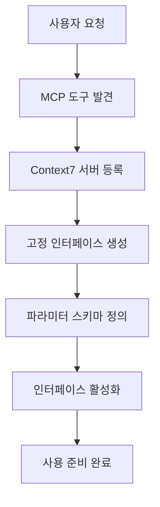
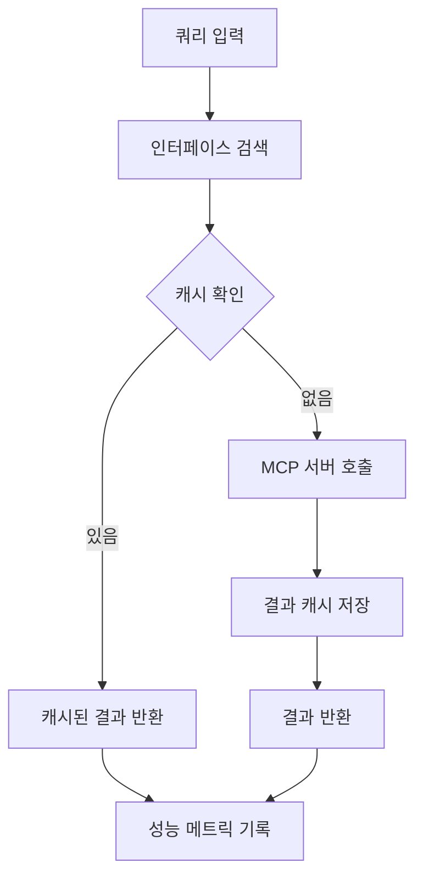

# MCP-Fixer 고정 인터페이스 기능 동작 방식 문서

## 개요

mcp-fixer의 고정 인터페이스 기능은 MCP(Model Context Protocol) 서버의 특정 작업을 사전 정의하고 캐시하여, 반복적인 쿼리를 빠르고 효율적으로 수행할 수 있게 하는 시스템입니다.

## 요구사항 분석

### 목표
- Context7의 `www_tradingview_com-pine-script-docs`를 고정 설정
- 라이브러리 ID는 고정하고, `topic` 파라미터만 변경하여 검색
- 반복 사용을 통한 검색 속도 향상 및 일관성 보장

### 현재 상황 문제점
- Context7을 직접 호출하여 검색하고 있음 (비효율적)
- mcp-fixer의 고정 인터페이스 시스템을 활용하지 못함
- 캐싱과 성능 최적화 기능을 사용하지 못함

## 시스템 아키텍처

### 1. 고정 인터페이스 등록 프로세스



### 2. 고정 인터페이스 실행 프로세스



## 상세 구현 방식

### Phase 1: 초기 설정 및 등록

#### 1.1 MCP 도구 발견
```bash
# Context7 MCP 서버 발견 (현재 구현되지 않음 - 수동으로 진행)
# mcp-tool discover context7-server-endpoint

# 현재 상황: Context7이 등록되어 있지 않음
# 해결 방법: Context7 MCP 서버를 수동으로 등록해야 함
```

#### 1.2 고정 인터페이스 등록
```bash
# TradingView Pine Script 전용 고정 인터페이스 등록
mcp-tool fixed register context7 get-library-docs \
  --name "tradingview-pinescript-search" \
  --description "TradingView Pine Script 문서 전용 고정 검색 인터페이스" \
  --parameters '{
    "type": "object",
    "properties": {
      "context7CompatibleLibraryID": {
        "type": "string",
        "const": "/websites/www_tradingview_com-pine-script-docs",
        "description": "TradingView Pine Script 문서 라이브러리 ID (고정값)"
      },
      "topic": {
        "type": "string",
        "description": "검색할 주제나 키워드 (가변 파라미터)",
        "examples": [
          "getting started",
          "first script",
          "variables and operators",
          "arrays and loops",
          "strategy functions"
        ]
      },
      "tokens": {
        "type": "number",
        "default": 5000,
        "minimum": 1000,
        "maximum": 10000,
        "description": "응답 최대 토큰 수"
      }
    },
    "required": ["context7CompatibleLibraryID", "topic"]
  }' \
  --response-schema '{
    "type": "object",
    "properties": {
      "documentation": {
        "type": "string",
        "description": "검색된 문서 내용"
      },
      "codeSnippets": {
        "type": "array",
        "items": {
          "type": "object",
          "properties": {
            "title": {"type": "string"},
            "code": {"type": "string"},
            "language": {"type": "string"},
            "source": {"type": "string"}
          }
        }
      },
      "metadata": {
        "type": "object",
        "properties": {
          "totalSnippets": {"type": "number"},
          "libraryInfo": {"type": "object"}
        }
      }
    }
  }' \
  --version "1.0.0" \
  --auto-discover \
  --validate-operation
```

### Phase 2: 사용 단계

#### 2.1 기본 검색 사용법
```bash
# Pine Script 초보자 가이드 검색
mcp-tool fixed use tradingview-pinescript-search '{
  "topic": "getting started first script beginners tutorial"
}'

# 특정 함수 검색
mcp-tool fixed use tradingview-pinescript-search '{
  "topic": "strategy functions buy sell signals",
  "tokens": 8000
}'

# 배열 관련 검색
mcp-tool fixed use tradingview-pinescript-search '{
  "topic": "arrays for loops iteration"
}'
```

#### 2.2 파일 기반 검색
```bash
# 검색 파라미터 파일 생성
cat > pine-beginner-search.json << EOF
{
  "topic": "first script getting started tutorial basic syntax",
  "tokens": 6000
}
EOF

# 파일을 통한 검색 실행
mcp-tool fixed use tradingview-pinescript-search --params-file pine-beginner-search.json
```

#### 2.3 배치 검색 스크립트
```bash
#!/bin/bash
# pine-batch-search.sh

declare -a topics=(
  "getting started tutorial"
  "variables and operators" 
  "conditional statements if else"
  "loops for while"
  "arrays and matrices"
  "plotting and visualization"
  "strategy development"
  "indicators and overlays"
  "time functions and sessions"
  "debugging and optimization"
)

for topic in "${topics[@]}"; do
  echo "검색 중: $topic"
  
  mcp-tool fixed use tradingview-pinescript-search "{
    \"topic\": \"$topic\",
    \"tokens\": 6000
  }" --output json > "results/$(echo "$topic" | tr ' ' '_').json"
  
  echo "완료: results/$(echo "$topic" | tr ' ' '_').json"
  sleep 1  # API 호출 간격 조절
done
```

### Phase 3: 성능 모니터링 및 최적화

#### 3.1 성능 통계 확인
```bash
# 인터페이스 성능 통계
mcp-tool fixed stats tradingview-pinescript-search --detailed

# 캐시 효율성 분석
mcp-tool fixed stats tradingview-pinescript-search --period 7d --trend

# 성능 비교 (고정 vs 동적 검색)
mcp-tool fixed test tradingview-pinescript-search --compare-performance
```

#### 3.2 인터페이스 유효성 검사
```bash
# 연결성 테스트
mcp-tool fixed test tradingview-pinescript-search --test-connectivity

# 스키마 검증
mcp-tool fixed test tradingview-pinescript-search --validate-schema

# 종합 테스트
mcp-tool fixed test tradingview-pinescript-search --comprehensive
```

## 데이터베이스 스키마 설계

### 고정 인터페이스 테이블
```sql
CREATE TABLE fixed_interfaces (
  id INTEGER PRIMARY KEY AUTOINCREMENT,
  tool_id TEXT NOT NULL,
  name TEXT NOT NULL UNIQUE,
  display_name TEXT,
  description TEXT,
  schema_json TEXT NOT NULL,
  parameters_json TEXT NOT NULL,
  response_schema_json TEXT,
  version TEXT DEFAULT '1.0.0',
  is_active BOOLEAN DEFAULT 1,
  created_at DATETIME DEFAULT CURRENT_TIMESTAMP,
  updated_at DATETIME DEFAULT CURRENT_TIMESTAMP,
  last_validated DATETIME,
  cache_timeout INTEGER DEFAULT 3600,
  FOREIGN KEY (tool_id) REFERENCES tools(id)
);
```

### 실행 기록 테이블
```sql
CREATE TABLE interface_executions (
  id INTEGER PRIMARY KEY AUTOINCREMENT,
  interface_id INTEGER NOT NULL,
  parameters_hash TEXT NOT NULL,
  response_time INTEGER NOT NULL,
  success BOOLEAN NOT NULL,
  cache_hit BOOLEAN DEFAULT 0,
  error_message TEXT,
  executed_at DATETIME DEFAULT CURRENT_TIMESTAMP,
  FOREIGN KEY (interface_id) REFERENCES fixed_interfaces(id)
);
```

### 캐시 테이블
```sql
CREATE TABLE interface_cache (
  id INTEGER PRIMARY KEY AUTOINCREMENT,
  interface_id INTEGER NOT NULL,
  parameters_hash TEXT NOT NULL,
  response_data TEXT NOT NULL,
  created_at DATETIME DEFAULT CURRENT_TIMESTAMP,
  expires_at DATETIME NOT NULL,
  access_count INTEGER DEFAULT 0,
  last_accessed DATETIME DEFAULT CURRENT_TIMESTAMP,
  UNIQUE(interface_id, parameters_hash),
  FOREIGN KEY (interface_id) REFERENCES fixed_interfaces(id)
);
```

## 캐싱 전략

### 1. 캐시 키 생성
```typescript
function generateCacheKey(interfaceId: number, parameters: object): string {
  const sortedParams = Object.keys(parameters)
    .sort()
    .reduce((result, key) => {
      result[key] = parameters[key];
      return result;
    }, {});
  
  const paramsString = JSON.stringify(sortedParams);
  return crypto.createHash('sha256').update(paramsString).digest('hex');
}
```

### 2. 캐시 만료 정책
- **기본 TTL**: 1시간 (3600초)
- **검색 빈도 기반**: 자주 검색되는 주제는 TTL 연장
- **LRU 정책**: 메모리 부족 시 가장 오래 사용되지 않은 캐시 제거

### 3. 캐시 무효화
- 스키마 변경 시 관련 캐시 전체 삭제
- 수동 캐시 정리 명령어 제공
- 주기적 캐시 검증 및 정리

## 오류 처리 및 복구

### 1. MCP 서버 연결 실패
```bash
# 연결 상태 확인
mcp-tool tools context7 --test-connection

# 대안: 직접 Context7 호출로 fallback
# (현재 구현에서는 이 방법이 작동함)
```

### 2. 캐시 오류
```bash
# 캐시 정리
mcp-tool fixed stats tradingview-pinescript-search --clear-cache

# 캐시 재구성
mcp-tool fixed test tradingview-pinescript-search --rebuild-cache
```

### 3. 스키마 불일치
```bash
# 스키마 검증
mcp-tool fixed test tradingview-pinescript-search --validate-schema

# 스키마 업데이트
mcp-tool fixed register context7 get-library-docs --force --auto-discover
```

## 구현 우선순위

### 1차 우선순위 (필수 구현)
- [ ] Context7 MCP 서버 등록 기능
- [ ] 고정 인터페이스 등록 시스템
- [ ] 기본 캐싱 메커니즘
- [ ] 파라미터 검증 및 실행

### 2차 우선순위 (성능 향상)
- [ ] 지능형 캐시 관리
- [ ] 성능 메트릭 수집
- [ ] 배치 검색 최적화
- [ ] 오류 복구 메커니즘

### 3차 우선순위 (편의성 개선)
- [ ] 웹 UI 인터페이스
- [ ] 검색 결과 내보내기
- [ ] 검색 히스토리 관리
- [ ] 자동완성 기능

## 예상 성능 개선 효과

### 캐시 적중률 기반 성능
- **첫 번째 검색**: ~2-5초 (MCP 서버 호출)
- **캐시된 검색**: ~50-100ms (로컬 데이터베이스 조회)
- **성능 향상**: 20-100배 빠른 응답 시간

### 리소스 효율성
- **토큰 사용량**: 중복 검색 시 토큰 소비 없음
- **네트워크 트래픽**: 캐시 적중 시 네트워크 사용 없음
- **서버 부하**: MCP 서버에 대한 요청 빈도 감소

## 사용자 워크플로우

### 일반적인 사용 패턴
1. **초기 설정** (한 번만): 고정 인터페이스 등록
2. **반복 사용**: 다양한 주제로 검색
3. **결과 활용**: 검색 결과를 Pine Script 개발에 활용
4. **성능 모니터링**: 정기적 성능 확인 및 최적화

### 고급 사용 패턴
1. **배치 검색**: 여러 주제 일괄 검색
2. **결과 분석**: 검색 패턴 분석을 통한 최적화
3. **커스텀 스크립트**: 사용자 정의 검색 도구 개발
4. **팀 공유**: 검색 결과 및 설정 공유

이 문서에 따라 구현하면 Context7의 TradingView Pine Script 문서 검색을 효율적이고 일관성 있게 수행할 수 있는 시스템을 구축할 수 있습니다.