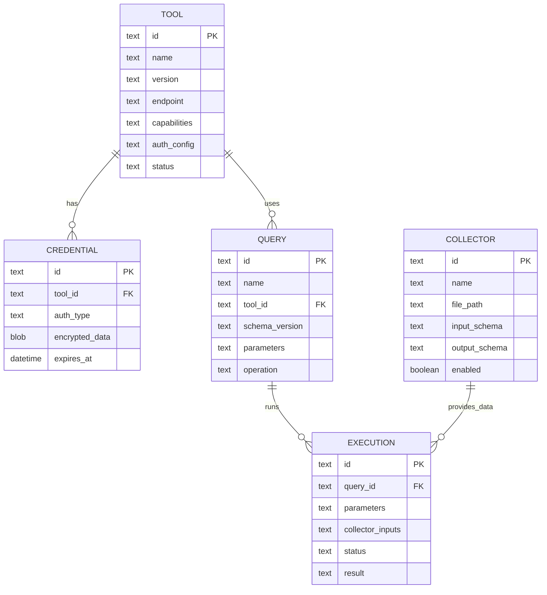

# Data Model: MCP Tool Management & Query System

**Date**: 2025-09-09  
**Purpose**: Define core entities and their relationships based on feature requirements

## Core Entities

### Query
Reusable operation template containing tool invocation patterns, parameter definitions, and expected output formats.

**Fields**:
- `id`: Unique identifier (UUID)
- `name`: Human-readable query name
- `description`: Query purpose and usage
- `tool_id`: Reference to Tool Definition
- `schema_version`: Query schema version for compatibility
- `parameters`: JSON schema for input parameters
- `operation`: MCP tool operation specification
- `output_schema`: Expected output format schema
- `created_at`: Creation timestamp
- `updated_at`: Last modification timestamp
- `execution_count`: Usage statistics
- `last_executed`: Last execution timestamp

**Validation Rules**:
- Name must be unique per user
- Parameters must be valid JSON schema
- Operation must reference valid MCP tool capability
- Schema version must follow semantic versioning

**State Transitions**:
- Draft → Validated → Active → Deprecated

### Tool Definition
Metadata about MCP tools including capabilities, authentication requirements, and parameter schemas.

**Fields**:
- `id`: Unique identifier (UUID)
- `name`: Tool name from MCP specification
- `version`: Tool version
- `description`: Tool capabilities description
- `endpoint`: Tool connection endpoint
- `capabilities`: JSON array of supported operations
- `auth_config`: Authentication configuration
- `schema`: Tool parameter and response schemas
- `discovery_data`: Additional metadata from discovery
- `status`: Tool availability status
- `last_checked`: Last availability check
- `created_at`: Discovery timestamp

**Validation Rules**:
- Name and version combination must be unique
- Endpoint must be valid URI
- Capabilities must match MCP specification
- Auth config must specify supported methods

**State Transitions**:
- Discovered → Validated → Active → Inactive → Deprecated

### Credential Store
Secure storage for authentication tokens, API keys, and other access credentials.

**Fields**:
- `id`: Unique identifier (UUID)
- `tool_id`: Reference to Tool Definition
- `auth_type`: Authentication method (api_key, bearer, basic)
- `encrypted_data`: Encrypted credential data
- `encryption_key_id`: Reference to encryption key
- `expires_at`: Credential expiration (if applicable)
- `created_at`: Creation timestamp
- `last_used`: Last usage timestamp
- `usage_count`: Usage statistics

**Validation Rules**:
- Auth type must match tool's supported methods
- Encrypted data must be valid AES-256 encrypted blob
- Expiration must be future date (if set)

**State Transitions**:
- Active → Expiring → Expired → Renewed

### Data Collector
Custom modules that gather data from external sources and format it for query consumption.

**Fields**:
- `id`: Unique identifier (UUID)
- `name`: Collector name
- `description`: Collector purpose
- `file_path`: Path to collector module
- `input_schema`: Expected input parameter schema
- `output_schema`: Generated output schema
- `timeout`: Execution timeout in seconds
- `enabled`: Collector availability flag
- `version`: Collector version
- `created_at`: Registration timestamp
- `last_executed`: Last execution timestamp
- `execution_count`: Usage statistics

**Validation Rules**:
- Name must be unique
- File path must exist and be executable
- Input/output schemas must be valid JSON schemas
- Timeout must be positive integer

**State Transitions**:
- Registered → Validated → Active → Disabled → Removed

### Execution Context
Runtime environment that combines queries, data collectors, and credentials for operation execution.

**Fields**:
- `id`: Unique identifier (UUID)
- `query_id`: Reference to Query
- `parameters`: Runtime parameter values
- `collector_inputs`: Data collector execution results
- `credential_refs`: Required credential references
- `status`: Execution status
- `started_at`: Execution start time
- `completed_at`: Execution completion time
- `result`: Execution result data
- `error_details`: Error information (if failed)

**Validation Rules**:
- Parameters must match query parameter schema
- Collector inputs must match expected schemas
- All required credentials must be available

**State Transitions**:
- Pending → Running → Completed | Failed | Cancelled

## Database Schema

### SQLite Tables

```sql
-- Tools table
CREATE TABLE tools (
    id TEXT PRIMARY KEY,
    name TEXT NOT NULL,
    version TEXT NOT NULL,
    description TEXT,
    endpoint TEXT NOT NULL,
    capabilities TEXT NOT NULL, -- JSON array
    auth_config TEXT NOT NULL, -- JSON object
    schema TEXT, -- JSON object
    discovery_data TEXT, -- JSON object
    status TEXT DEFAULT 'active',
    last_checked DATETIME DEFAULT CURRENT_TIMESTAMP,
    created_at DATETIME DEFAULT CURRENT_TIMESTAMP,
    UNIQUE(name, version)
);

-- Credentials table
CREATE TABLE credentials (
    id TEXT PRIMARY KEY,
    tool_id TEXT NOT NULL,
    auth_type TEXT NOT NULL,
    encrypted_data BLOB NOT NULL,
    encryption_key_id TEXT NOT NULL,
    expires_at DATETIME,
    created_at DATETIME DEFAULT CURRENT_TIMESTAMP,
    last_used DATETIME,
    usage_count INTEGER DEFAULT 0,
    FOREIGN KEY(tool_id) REFERENCES tools(id) ON DELETE CASCADE
);

-- Queries table
CREATE TABLE queries (
    id TEXT PRIMARY KEY,
    name TEXT NOT NULL UNIQUE,
    description TEXT,
    tool_id TEXT NOT NULL,
    schema_version TEXT NOT NULL DEFAULT '1.0.0',
    parameters TEXT NOT NULL, -- JSON schema
    operation TEXT NOT NULL, -- JSON object
    output_schema TEXT, -- JSON schema
    created_at DATETIME DEFAULT CURRENT_TIMESTAMP,
    updated_at DATETIME DEFAULT CURRENT_TIMESTAMP,
    execution_count INTEGER DEFAULT 0,
    last_executed DATETIME,
    FOREIGN KEY(tool_id) REFERENCES tools(id) ON DELETE CASCADE
);

-- Data collectors table
CREATE TABLE collectors (
    id TEXT PRIMARY KEY,
    name TEXT NOT NULL UNIQUE,
    description TEXT,
    file_path TEXT NOT NULL,
    input_schema TEXT NOT NULL, -- JSON schema
    output_schema TEXT NOT NULL, -- JSON schema
    timeout INTEGER DEFAULT 30,
    enabled BOOLEAN DEFAULT TRUE,
    version TEXT NOT NULL DEFAULT '1.0.0',
    created_at DATETIME DEFAULT CURRENT_TIMESTAMP,
    last_executed DATETIME,
    execution_count INTEGER DEFAULT 0
);

-- Execution contexts table
CREATE TABLE executions (
    id TEXT PRIMARY KEY,
    query_id TEXT NOT NULL,
    parameters TEXT, -- JSON object
    collector_inputs TEXT, -- JSON object
    credential_refs TEXT, -- JSON array
    status TEXT DEFAULT 'pending',
    started_at DATETIME DEFAULT CURRENT_TIMESTAMP,
    completed_at DATETIME,
    result TEXT, -- JSON object
    error_details TEXT, -- JSON object
    FOREIGN KEY(query_id) REFERENCES queries(id) ON DELETE CASCADE
);

-- Indexes for performance
CREATE INDEX idx_tools_name ON tools(name);
CREATE INDEX idx_tools_status ON tools(status);
CREATE INDEX idx_credentials_tool_id ON credentials(tool_id);
CREATE INDEX idx_credentials_auth_type ON credentials(auth_type);
CREATE INDEX idx_queries_tool_id ON queries(tool_id);
CREATE INDEX idx_queries_name ON queries(name);
CREATE INDEX idx_collectors_name ON collectors(name);
CREATE INDEX idx_collectors_enabled ON collectors(enabled);
CREATE INDEX idx_executions_query_id ON executions(query_id);
CREATE INDEX idx_executions_status ON executions(status);
CREATE INDEX idx_executions_started_at ON executions(started_at);
```

## Entity Relationships



## Validation Logic

### Query Parameter Validation
```typescript
interface QueryValidation {
  validateParameters(query: Query, parameters: unknown): ValidationResult;
  validateOperation(query: Query, tool: Tool): ValidationResult;
  validateOutputSchema(query: Query, actualOutput: unknown): ValidationResult;
}
```

### Credential Validation
```typescript
interface CredentialValidation {
  validateAuthMethod(credential: Credential, tool: Tool): ValidationResult;
  validateExpiration(credential: Credential): ValidationResult;
  validateEncryption(credential: Credential): ValidationResult;
}
```

### Collector Compatibility
```typescript
interface CollectorValidation {
  validateInputCompatibility(collector: Collector, input: unknown): ValidationResult;
  validateOutputSchema(collector: Collector, output: unknown): ValidationResult;
  validateExecutionEnvironment(collector: Collector): ValidationResult;
}
```

## Migration Strategy

### Schema Versioning
- Database schema version tracked in metadata table
- Migration scripts for version upgrades
- Backward compatibility for query schema versions
- Data integrity checks after migrations

### Query Compatibility
- Query schema version field for compatibility tracking
- Automatic parameter mapping for minor version changes
- Manual migration required for major breaking changes
- Deprecation warnings for outdated query formats

---

**Next**: Generate contracts/ directory with CLI specifications and API contracts